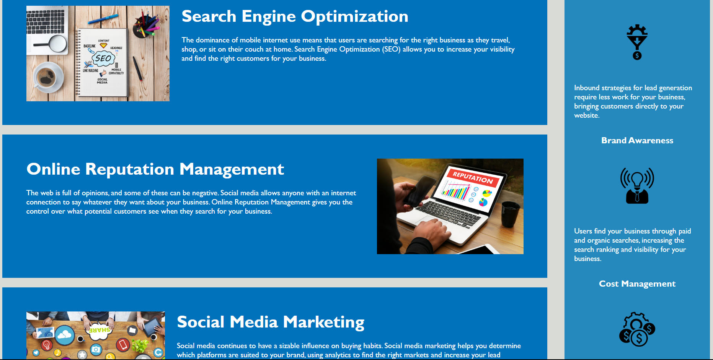

# Horiseon Accessibility project
Starter code:  
https://github.com/coding-boot-camp/urban-octo-telegram.git

# Horiseon-Project
Link to hosted site:  
https://tophewattigny.github.io/Horiseon-Accessibility-Project/  

This was a refactoring of Horiseon's HTML and CSS. 

# Methods
Examined HTML and CSS files, made sure items were up to accessibility standards, reviewed source code, added alt tags to images, and added comments to break up the sections and improve readability. Ran site through contrast checker to ensure site colors met accessability requirements.
 
 
